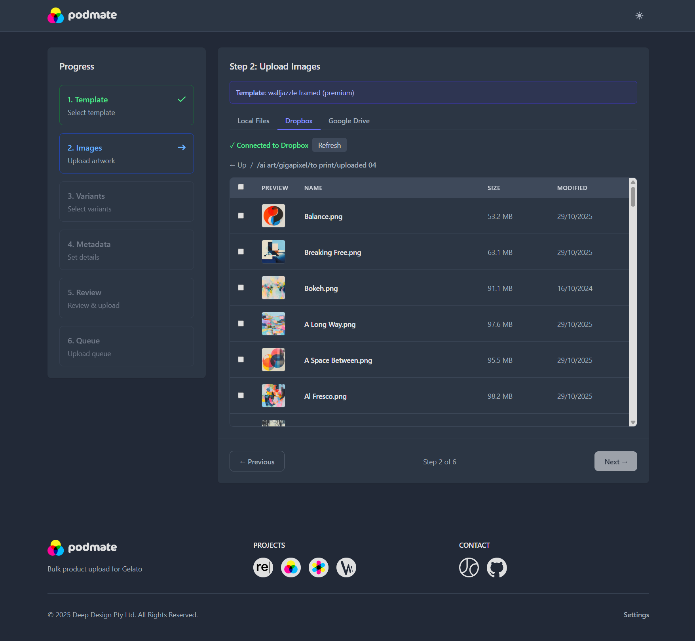

<div align="center">


# Podmate

**Bulk product upload for Gelato**

A powerful web application for bulk-creating Gelato print-on-demand products from templates. Upload images from local files, Dropbox, or Google Drive, map them to product variants, and create products via the Gelato API.

[](https://nodejs.org/)
[](https://www.typescriptlang.org/)
[](https://reactjs.org/)
[](LICENSE)

---

</div>

## 📸 Screenshot

<div align="center">



*The Podmate interface showing the step-based workflow for bulk product creation*

</div>

---

## ✨ Features

### 🚀 Core Functionality
- **Multi-source Image Upload**: Upload images from local files, Dropbox, or Google Drive
- **Template Management**: Load one or more Gelato product templates and view variant details
- **Image Mapping**: Map uploaded images to template placeholders with automatic filename-based matching
- **Variant Selection**: Choose which product variants to create for each image (all variants selected by default)
- **Metadata Configuration**: Set product titles, descriptions, tags, visibility, and sales channels
- **Batch Processing**: Queue-based system for uploading multiple products with real-time status tracking

### 🔄 Smart Features
- **State Persistence**: Application state persists across page refreshes, allowing you to resume work
- **Progress Tracking**: Queue progress is saved and restored on page refresh
- **Duplicate Prevention**: Built-in safeguards prevent duplicate product creation
- **Status Monitoring**: Track product creation status with automatic polling and URL regeneration

### ☁️ Cloud Integration
- **OAuth2 Authentication**: Secure authentication for Dropbox and Google Drive
- **Persistent Connections**: Connections are automatically saved and persist across browser sessions
- **Auto Token Refresh**: Tokens are automatically refreshed when expired or close to expiry

### 🎨 User Experience
- **Dark Mode**: Built-in dark mode support with theme-aware components
- **CSV Export**: Export upload results with product IDs and status information
- **Success Panel**: View your products in Gelato dashboard directly from the success message
- **Responsive Design**: Works seamlessly on desktop, tablet, and mobile devices

---

## 🚀 Quick Start

### Prerequisites

- **Node.js** (v18 or higher)
- **npm** or **yarn**
- **Cloudflare Tunnel CLI** (`cloudflared`) or **ngrok** for file serving

### Installation

<details>
<summary><b>1. Install Dependencies</b></summary>

```bash
npm install
cd server && npm install
cd ../client && npm install
```

</details>

<details>
<summary><b>2. Configure Environment</b></summary>

Copy the example environment file and fill in your credentials:

```bash
# Windows
copy .env.example .env

# Linux/Mac
cp .env.example .env
```

Then edit `.env` with your actual values:

```env
# Gelato API Configuration (Required)
GELATO_API_KEY=your_api_key
GELATO_STORE_ID=your_store_id

# Optional: Default template ID
GELATO_TEMPLATE_ID=your_template_id

# Optional: Default product metadata
GELATO_PRODUCT_TITLE=Walljazzle
GELATO_PRODUCT_DESCRIPTION=A beautiful Walljazzle print

# Tunnel Configuration (Required for Gelato to access files)
PUBLIC_BASE_URL=https://your-tunnel-url.trycloudflare.com
SERVER_PORT=5175

# Cloud Storage OAuth (Optional - for Dropbox/Google Drive integration)
DROPBOX_APP_KEY=your_dropbox_app_key
DROPBOX_APP_SECRET=your_dropbox_app_secret
GOOGLE_DRIVE_CLIENT_ID=your_google_client_id
GOOGLE_DRIVE_CLIENT_SECRET=your_google_client_secret
```

</details>

<details>
<summary><b>3. Set Up Tunnel</b></summary>

**Option A: Using PowerShell scripts** (Windows):
```powershell
# First time setup
.\setup-tunnel.ps1

# Start tunnel (auto-updates .env file)
.\start-tunnel.ps1
```

**Option B: Manual setup**:
```bash
# Using Cloudflare Tunnel
cloudflared tunnel --url http://localhost:5175

# Or using ngrok
ngrok http 5175
```

Copy the generated HTTPS URL and update `PUBLIC_BASE_URL` in your `.env` file.

</details>

<details>
<summary><b>4. Start Development Servers</b></summary>

**Option A: Using batch script** (Windows):
```bash
# Double-click or run:
start-server.bat
```

**Option B: Using npm**:
```bash
npm run dev
```

- **Client** runs on `http://localhost:5173` (Vite dev server)
- **Server** runs on `http://localhost:5175` (Express API)

</details>

<details>
<summary><b>5. Open the App</b></summary>

Navigate to `http://localhost:5173` in your browser.

</details>

---

## 📋 Workflow

The application uses a step-based workflow:

```
1. Template Selection  →  2. Image Upload  →  3. Variant Selection
         ↓                      ↓                      ↓
6. Queue Monitoring  ←  5. Review & Upload  ←  4. Metadata
```

### Step-by-Step

1. **Template Selection**: Paste template IDs and load template details
2. **Image Upload**: Upload images from local files, Dropbox, or Google Drive
3. **Variant Selection**: Choose which variants to create for each image
4. **Metadata**: Set product titles, descriptions, tags, and visibility settings
5. **Review**: Review your configuration before uploading
6. **Queue**: Monitor product creation with real-time status updates

---

## ☁️ Cloud Storage Integration

### Dropbox

<details>
<summary><b>Setup Instructions</b></summary>

1. **Create a Dropbox App**:
   - Go to [Dropbox App Console](https://www.dropbox.com/developers/apps)
   - Create a new app with "Full Dropbox" access
   - Set the redirect URI: `http://localhost:5175/api/dropbox/callback`
   - Copy the App Key and App Secret to your `.env` file

2. **Connect in the App**:
   - Navigate to the Image Upload step
   - Click "Connect Dropbox" on the Dropbox tab
   - Authorize the application
   - Browse and select files from your Dropbox

3. **Connection Persistence**:
   - Your Dropbox connection is automatically saved and persists across browser sessions
   - Tokens are automatically refreshed when expired or close to expiry
   - You only need to reconnect if the refresh token is revoked in Dropbox settings

4. **File Selection**:
   - Click individual files to select/deselect
   - Hold Shift and click to select a range of files
   - Use "Select All" to select all visible files

</details>

### Google Drive

<details>
<summary><b>Setup Instructions</b></summary>

1. **Create a Google Cloud Project**:
   - Go to [Google Cloud Console](https://console.cloud.google.com/)
   - Create a new project
   - Enable Google Drive API
   - Create OAuth 2.0 credentials
   - Add redirect URI: `http://localhost:5175/api/googledrive/callback`
   - Copy Client ID and Client Secret to your `.env` file
   - Add test users in OAuth consent screen if in testing mode

2. **Connect in the App**:
   - Navigate to the Image Upload step
   - Click "Connect Google Drive" on the Google Drive tab
   - Authorize the application
   - Browse and select files from your Google Drive

</details>

---

## 🔒 Security

### Protecting Sensitive Data

⚠️ **CRITICAL**: Never commit sensitive data to version control!

- **`.env` file is gitignored**: Your `.env` file containing API keys and secrets is automatically excluded from Git
- **Create `.env` from template**: Copy `.env.example` to `.env` and fill in your actual credentials
- **Check before committing**: Always run `git status` before committing to ensure no sensitive files are included

### Application Security

- **API Key Protection**: `GELATO_API_KEY` is server-only and never exposed to the client
- **Token Signing**: Public file URLs use HMAC-SHA256 tokens with 15-minute expiry
- **Token Masking**: Tokens are masked in logs for security
- **Directory Traversal Protection**: File paths are validated against the temp directory
- **CORS**: Configured for localhost during development
- **OAuth Tokens**: Stored in browser localStorage only (never in files)

---

## 🛠️ Development

### Project Structure

```
.
├── client/          # React + TypeScript frontend
│   ├── src/
│   │   ├── components/   # UI components
│   │   ├── lib/          # Utilities and API client
│   │   ├── pages/        # Page components
│   │   └── styles/       # Global styles
├── server/          # Express + TypeScript backend
│   ├── src/
│   │   ├── routes/       # API routes
│   │   ├── services/     # Business logic
│   │   └── util/         # Utilities
└── docs/            # Documentation
```

### Scripts

```bash
# Development (runs both client and server)
npm run dev

# Or on Windows, use the batch script:
start-server.bat

# Build for production
npm run build

# Run tests (placeholder)
npm test
```

### Tech Stack

**Frontend**:
- React 18
- TypeScript
- Vite
- Tailwind CSS
- React Router

**Backend**:
- Express
- TypeScript
- Multer (file uploads)
- Sharp (image processing)

### UI Assets

- **Logo**: Theme-aware logo component that displays horizontal light/dark variants based on the current theme
- **Favicon**: Multi-size favicon setup using Podmate brandmark PNG files (16px to 192px) with Apple touch icon support

---

## 📦 Building for Production

```bash
npm run build
```

- **Client build**: `client/dist/`
- **Server build**: `server/dist/`

To run the production server:

```bash
cd server
NODE_ENV=production node dist/index.js
```

---

## 📝 Important Notes

- **API Compliance**: This app uses only fields documented in the official Gelato API. No undocumented fields are assumed.
- **File Serving**: Files must be accessible via HTTPS for Gelato to fetch them. A tunnel service is required.
- **Large Files**: High-resolution images (50-100MB+) may take 30-60+ minutes to process in Gelato.
- **Token Expiry**: Cloud storage OAuth tokens are automatically refreshed when possible.
- **State Persistence**: Application state (template, images, queue progress) is saved to browser sessionStorage and persists across page refreshes.
- **Queue Management**: Queue processing must be explicitly started via the "Start Queue" button - products are not created automatically.

---

## 🔧 File Serving

Files are served locally via signed URLs with HMAC token authentication:

- **Security**: 15-minute expiry tokens prevent unauthorized access
- **Local Storage**: Files are stored in `server/tmp/` with opaque identifiers
- **Public URLs**: Generated as `${PUBLIC_BASE_URL}/public-files/:fileId?t=<token>&e=<expiry>`
- **Tunnel Required**: Gelato must be able to access your server via HTTPS, requiring a tunnel service

---

## 🐛 Troubleshooting

<details>
<summary><b>Tunnel Issues</b></summary>

- **Tunnel URL Not Working**: 
  - Verify tunnel is running and accessible from external network
  - Check `PUBLIC_BASE_URL` is set correctly in `.env`
  - Ensure firewall allows tunnel traffic

</details>

<details>
<summary><b>Gelato API Errors</b></summary>

- Verify `GELATO_API_KEY` is correct
- Check `GELATO_STORE_ID` is valid
- Review Gelato API documentation for exact field requirements
- Ensure request payload matches exact schema from docs

</details>

<details>
<summary><b>File Upload Issues</b></summary>

- Verify `server/tmp/` directory exists and is writable
- Check file size limits (default: 100MB)
- Ensure tunnel URL is accessible for file serving
- For cloud storage: verify OAuth tokens are valid and not expired

</details>

<details>
<summary><b>Cloud Storage Issues</b></summary>

- **Dropbox**: Ensure app is set to "Full Dropbox" (not "App Folder")
- **Google Drive**: Verify OAuth consent screen is configured and test users are added if in testing mode
- **Token Expiry**: Tokens are automatically refreshed, but reconnect if refresh fails
- **Connection Lost**: If your Dropbox connection is lost, simply reconnect - the app will remember your connection for future sessions

</details>

---

## 📚 Documentation

- [Implementation Details](./docs/IMPLEMENTATION.md) - Detailed architecture and API documentation
- [API Checklist](./docs/API_CHECKLIST.md) - API compliance and verification checklist

---

## 📄 License

**Private - All Rights Reserved**

---

<div align="center">

**Made with ❤️ by [Deep Design](https://jamescutts.me/)**

</div>
